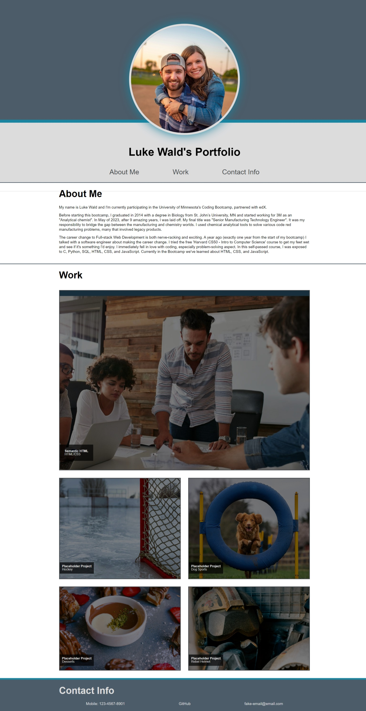

# My Portfolio

## Webpage Description

 This is a portfolio that highlights some of my best coding projects for a potential future employeer to review. It is made up of the following sections:

### Header / Navigation
Upon loading the webpage, the viewer is presented with a header that contains the my name, a recent photo, and links to sections on the webpage. These are: "About Me", "Work", and "Contact Me". If the user clicks on the navagation links, the UI will scroll the screen to the corresponding section.

### About Me
This section shares some information about my past work experience and my interests.

### Work
Currently I am in the early stages of bootcamp so I don't have projects to show off just yet to a potential employeer. In there place, I've linked them to the following places:
- The first project links to the repository to my first homework assignment. This is also the "priority" project. That means, it will be larger then the other project cards <ins>*until the window screen is shrunk to below 768px*</ins>. At this point, all projects will fall into a nice column.
- The other four project cards link to various Google searches about the specific topic they list, either hockey, dog spots, desserts, and a helmet from Star Wars.

As long as the screen size is larger then 768px, when the user hovers over a project, the image will zoom out and lighten up. The hover function is removed below 768px as people generally don't hover over items on their phones.

### Footer / Contact Me
The instructor advised us not to use our real phone numbers or emails at this time as it could lead to an increase to junk calls/emails. As a result, I've used fake ones in their place. The GitHub link does go to my actual GitHub however.

## Link to Website
The deployed website can be accesed [here](https://wald14.github.io/my-portfolio/)

## Acknowledgements

### Project Placeholder Images
- [Unsplash.com](https://unsplash.com/) [[License]](https://unsplash.com/license) [[Terms & Conditions]](https://unsplash.com/terms)
 

### UX Design
- [Example Portfolio](https://nicepage.com/website-templates/preview/web-design-portfolio-262230?device=desktop) - I did not inspect the code of this website, I only looked at it for visual design inspiration. The challenge of getting a circle around my portfolio photo seemed fun.
- [Color Palette](https://coolors.co/palette/dcdcdd-c5c3c6-46494c-4c5c68-1985a1)
 

### General Coding Tips & Tricks  
The following webpages held with general HTML and CSS coding for a wide variety of this webpage.
- [W3School](https://www.w3schools.com/)
- [MDN Web Docs](https://developer.mozilla.org/en-US/docs/Web/CSS/justify-content)
- [Photo Transitions](https://dev.to/nazanin_ashrafi/how-to-darken-an-image-with-css-4f5h) - specifically how to darken an image and have it zoom in and out when hovered over
 

### Other
- The reset.css file was premade by the bootcamp and my instructor gave us permission to use it.

## Site Preview
The following image shares the web application's apperance:
 

